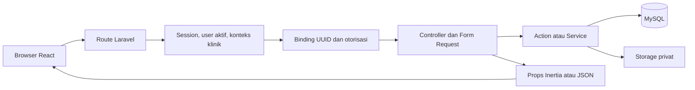
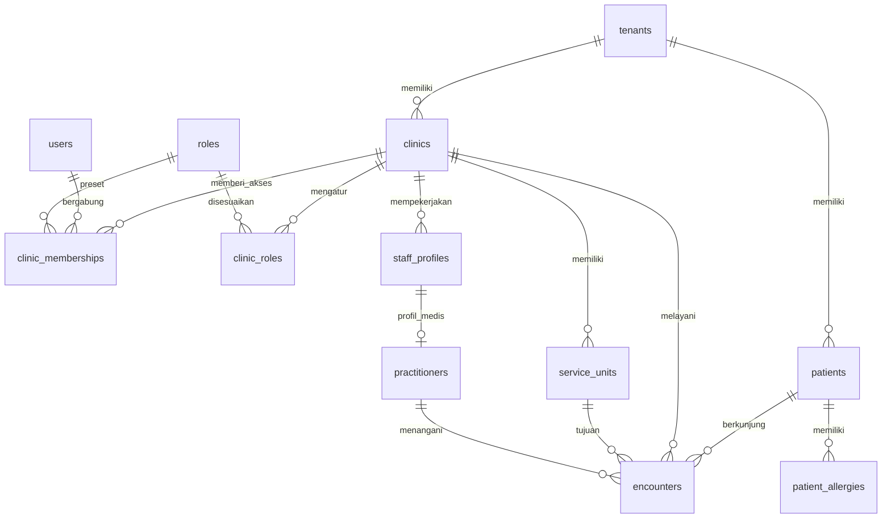
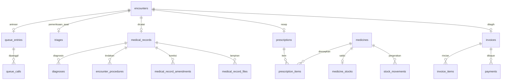
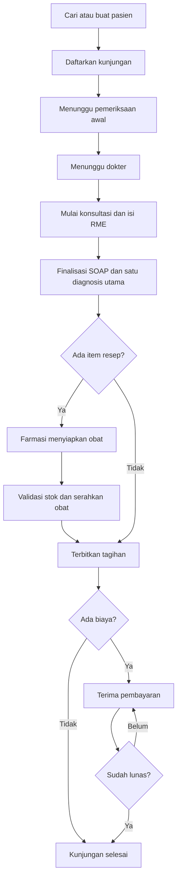

# Klinik — Dokumentasi Proyek

Aplikasi manajemen klinik rawat jalan dan rekam medis elektronik (RME) berbasis Laravel, Inertia, dan React. Fokusnya adalah pelayanan pasien dari pendaftaran sampai pembayaran, dengan akses petugas sesuai tugas dan pemisahan data antar-tenant.

**Snapshot dokumentasi: 14 September 2026.** Fitur di bawah disusun dari kode pada working tree, route aplikasi, migration, dan skema MySQL lokal. Status “tersedia” berarti implementasinya ditemukan; hasil pengujian ulang dan kesiapan deployment dijelaskan tersendiri. Dokumen ini menjadi acuan fitur, arsitektur, database, workflow, serta pengembangan berikutnya.

## Daftar isi

- [1. Kondisi proyek](#1-kondisi-proyek)
- [2. Fitur dan peran pengguna](#2-fitur-dan-peran-pengguna)
- [3. Arsitektur dan struktur kode](#3-arsitektur-dan-struktur-kode)
- [4. Struktur database](#4-struktur-database)
- [5. Workflow operasional](#5-workflow-operasional)
- [6. Keamanan dan operasional](#6-keamanan-dan-operasional)
- [7. Menjalankan proyek dan verifikasi](#7-menjalankan-proyek-dan-verifikasi)
- [8. Optimasi yang perlu dilanjutkan](#8-optimasi-yang-perlu-dilanjutkan)
- [9. Roadmap SaaS production](#9-roadmap-saas-production)
- [10. Roadmap integrasi SATUSEHAT](#10-roadmap-integrasi-satusehat)
- [11. Bukti pemeriksaan dan batas verifikasi](#11-bukti-pemeriksaan-dan-batas-verifikasi)

## 1. Kondisi proyek

| Area                | Kondisi saat ini                                                                               | Batas yang perlu dipahami                                                                                |
| ------------------- | ---------------------------------------------------------------------------------------------- | -------------------------------------------------------------------------------------------------------- |
| Operasional klinik  | Pasien, pendaftaran, antrean, triase, pemeriksaan dokter, resep, farmasi, dan kasir tersedia   | Perlu UAT dengan petugas klinik dan pengujian pada lingkungan menyerupai production                      |
| Administrasi        | Onboarding, profil klinik, master data, pengguna, izin peran, laporan, dan audit tersedia      | Katalog role berasal dari enam preset sistem; pengaturan izin dilakukan per klinik                       |
| Fondasi SaaS        | Tenant, klinik, membership, konteks klinik aktif, isolasi query, dan Platform Admin tersedia   | Paket, subscription, kuota, penagihan SaaS, serta pengelolaan cabang belum menjadi produk lengkap        |
| Masa percobaan      | Provisioning mengisi `trial_ends_at` 14 hari ke depan                                          | Belum ditemukan enforcement masa percobaan berakhir; middleware memeriksa status tenant aktif            |
| Integrasi SATUSEHAT | Kolom ID organisasi klinik, ID pasien, dan permission `integration.manage` tersedia            | Belum ada client API, mapper FHIR, kredensial integrasi, outbox, job sinkronisasi, atau layar monitoring |
| Operasional server  | Backup terenkripsi, verifikasi arsip, restore drill, scheduler, dan readiness command tersedia | Pemeriksaan lokal belum memenuhi seluruh syarat production; backup masih memakai disk lokal              |

Ruang lingkup saat ini adalah klinik rawat jalan. Appointment online, rawat inap, LIS/PACS/RIS, BPJS, patient portal, akuntansi lengkap, pengadaan obat, dan aplikasi mobile native belum diimplementasikan sebagai modul operasional.

## 2. Fitur dan peran pengguna

### Fitur yang sudah dibuat

| Modul                  | Kemampuan yang tersedia                                                                                                                                | Acuan kode                                                                                                                                                                                |
| ---------------------- | ------------------------------------------------------------------------------------------------------------------------------------------------------ | ----------------------------------------------------------------------------------------------------------------------------------------------------------------------------------------- |
| Akun                   | Registrasi, login/logout, reset kata sandi, profil, perubahan kata sandi, pembatasan login                                                             | [FortifyServiceProvider](app/Providers/FortifyServiceProvider.php), [konfigurasi Fortify](config/fortify.php)                                                                             |
| Tenant dan onboarding  | Registrasi membuat tenant, klinik awal, dan membership pemilik; onboarding lima langkah                                                                | [ProvisionTenantForUser](app/Actions/ProvisionTenantForUser.php), [OnboardingController](app/Http/Controllers/OnboardingController.php)                                                   |
| Profil klinik          | Identitas fasilitas, kontak, alamat, timezone, dan ID organisasi SATUSEHAT                                                                             | [ClinicController](app/Http/Controllers/ClinicController.php)                                                                                                                             |
| Pengguna dan peran     | Akun petugas, keaktifan membership, hubungan staf, role dasar, override izin per klinik, izin tambahan per pengguna                                    | [ClinicUserController](app/Http/Controllers/ClinicUserController.php), [ClinicRoleController](app/Http/Controllers/ClinicRoleController.php)                                              |
| Master data            | Staf, tenaga medis, unit layanan, layanan/tarif, dan obat; tambah, ubah, serta aktif/nonaktif                                                          | [MasterDataRegistry](app/Support/MasterDataRegistry.php), [MasterDataController](app/Http/Controllers/MasterDataController.php)                                                           |
| Pasien                 | Nomor rekam medis, identitas dan kontak, alergi, pencarian, pemeriksaan duplikasi, ringkasan dan riwayat kunjungan sesuai izin                         | [PatientController](app/Http/Controllers/PatientController.php), [PatientDuplicateDetector](app/Services/PatientDuplicateDetector.php)                                                    |
| Pendaftaran            | Walk-in, pilihan pasien/poli/dokter, keluhan, nomor registrasi dan antrean, tiket, daftar kunjungan berdasarkan tanggal, pembatalan beralasan          | [RegisterEncounter](app/Actions/RegisterEncounter.php), [RegistrationIndexController](app/Http/Controllers/RegistrationIndexController.php)                                               |
| Antrean                | Daftar antrean, panggil/panggil ulang, riwayat panggilan, monitor publik melalui tautan bertanda tangan dan kedaluwarsa                                | [CallQueue](app/Actions/CallQueue.php), [QueueBoard](app/Services/QueueBoard.php), [QueueDisplayController](app/Http/Controllers/QueueDisplayController.php)                              |
| Pemeriksaan awal       | Keluhan, tekanan darah, nadi, napas, suhu, saturasi, berat/tinggi badan, skala nyeri, draf dan penyelesaian triase                                     | [SaveTriage](app/Actions/SaveTriage.php), [TriageController](app/Http/Controllers/TriageController.php)                                                                                   |
| Antrean dokter dan RME | Mulai konsultasi, SOAP, diagnosis utama/tambahan, tindakan, resep, draf, finalisasi, riwayat, serta amendemen                                          | [DoctorQueueController](app/Http/Controllers/DoctorQueueController.php), [SaveMedicalRecord](app/Actions/SaveMedicalRecord.php), [AmendMedicalRecord](app/Actions/AmendMedicalRecord.php) |
| Lampiran RME           | Unggah PDF/JPG/PNG hingga 5 MB per berkas, penyimpanan privat, unduhan dengan otorisasi dan pencatatan akses                                           | [MedicalRecordFileController](app/Http/Controllers/MedicalRecordFileController.php), [StoreMedicalRecordFileRequest](app/Http/Requests/StoreMedicalRecordFileRequest.php)                 |
| Farmasi                | Daftar resep, mulai penyiapan, penyerahan obat, pembatalan resep, stok, penyesuaian stok beralasan, dan riwayat pergerakan                             | [PharmacyController](app/Http/Controllers/PharmacyController.php), [DispensePrescription](app/Actions/DispensePrescription.php)                                                           |
| Kasir                  | Satu invoice per kunjungan, snapshot harga, pembayaran sebagian, beberapa metode dalam satu transaksi, kuitansi, void pembayaran/tagihan, dan audit    | [GenerateInvoice](app/Actions/GenerateInvoice.php), [ReceiveInvoicePayments](app/Actions/ReceiveInvoicePayments.php), [BillingController](app/Http/Controllers/BillingController.php)     |
| Ringkasan              | Angka agregat operasional sesuai akses; daftar pasien tetap berada di modul kerja                                                                      | [DashboardController](app/Http/Controllers/DashboardController.php)                                                                                                                       |
| Laporan                | Kunjungan, penerimaan, tagihan, layanan, diagnosis, dokter, farmasi; filter periode, ringkasan, perbandingan periode, dan ekspor CSV                   | [ClinicReport](app/Services/ClinicReport.php), [ReportController](app/Http/Controllers/ReportController.php)                                                                              |
| Audit & Akses          | Filter kategori, tanggal, aksi, pencarian, aktor, dan referensi kejadian; kategori akses RME, klinis, triase, billing, farmasi, dan aktivitas aplikasi | [AuditLogController](app/Http/Controllers/AuditLogController.php), [AuditLogCatalog](app/Support/AuditLogCatalog.php)                                                                     |
| Platform Admin         | Ringkasan tenant dan detail metadata klinik                                                                                                            | [controller platform](app/Http/Controllers/Platform), [PromotePlatformAdmin](app/Console/Commands/PromotePlatformAdmin.php)                                                               |
| Backup dan readiness   | Arsip database + lampiran klinis, checksum, enkripsi, retensi, restore ke database sementara, pemeriksaan kesiapan                                     | [ClinicBackup](app/Services/ClinicBackup.php), [command operasional](app/Console/Commands)                                                                                                |

### Model pengguna dan hak akses

`User` adalah akun login, `StaffProfile` adalah identitas staf di klinik, dan `Practitioner` adalah tenaga medis. Hubungan akun ke klinik berada pada `ClinicMembership`. Staf atau dokter dapat dicatat sebelum memiliki akun.

| Preset                          | Fokus pekerjaan                                                                       |
| ------------------------------- | ------------------------------------------------------------------------------------- |
| Pemilik / Admin (`OWNER_ADMIN`) | Administrasi dan operasional klinik; dapat mengelola pekerjaan klinis di klinik aktif |
| Front Office (`FRONT_OFFICE`)   | Pasien, pendaftaran, dan antrean                                                      |
| Perawat (`NURSE`)               | Pemeriksaan awal dan antrean sesuai izin                                              |
| Dokter (`DOCTOR`)               | Antrean dokter, konsultasi, dan RME pasien yang ditangani                             |
| Farmasi (`PHARMACY`)            | Resep, penyerahan obat, dan stok                                                      |
| Kasir (`CASHIER`)               | Tagihan dan penerimaan pembayaran                                                     |

Menu dan aksi menggunakan **permission efektif**, bukan hanya nama role. Permission berasal dari pengaturan role klinik, dengan fallback preset sistem, kemudian ditambah grant individual. Pemilik/Admin mempertahankan akses katalog izin; pembatasan tenant dan klinik tetap berlaku.

Pemilik/Admin dapat memulai, menyimpan, memfinalisasi, dan mengamendemen RME tanpa berpura-pura menjadi dokter yang ditugaskan. Dokter penanggung jawab tetap tersimpan pada kunjungan; pengguna yang melakukan tindakan dicatat sebagai aktor. Lihat [CurrentPractitioner](app/Support/CurrentPractitioner.php) dan [MedicalRecordPolicy](app/Policies/MedicalRecordPolicy.php).

Flag `is_platform_admin` terpisah dari role klinik dan tidak memberikan akses otomatis ke rekam medis atau transaksi klinik. Role farmasi/kasir bawaan juga tidak perlu membuka seluruh daftar pasien.

## 3. Arsitektur dan struktur kode

### Stack

| Lapisan               | Teknologi                                                                            |
| --------------------- | ------------------------------------------------------------------------------------ |
| Backend               | PHP 8.4; Laravel 13, terpasang 13.30.1 saat pemeriksaan                              |
| Frontend              | React 19, TypeScript, Inertia 3; adapter Laravel terpasang 3.3.2                     |
| UI                    | Tailwind CSS 4, Radix UI, komponen bergaya shadcn/ui, Lucide, font Inter             |
| Autentikasi           | Laravel Fortify 1.39.0, session dan CSRF                                             |
| Route frontend        | Laravel Wayfinder 0.1.21                                                             |
| Data                  | MySQL untuk aplikasi; SQLite in-memory sebagai default Pest                          |
| Build dan pemeriksaan | Vite 8, Vite Plus 0.3.0, Oxlint/Oxfmt, Pest 5, PHPStan/Larastan, Pint                |
| Infrastruktur bawaan  | Session/cache/queue berbasis database; file klinis dan backup pada disk lokal privat |

Versi persis mengikuti [composer.lock](composer.lock) dan [package-lock.json](package-lock.json); batas dependency dan script terdapat di [composer.json](composer.json) serta [package.json](package.json). CI memakai PHP 8.4 dan Node.js 22.

### Alur request

Aplikasi berbentuk monolith dengan pemisahan tanggung jawab menurut domain. React menerima props melalui Inertia; pencarian katalog/pasien tertentu memakai endpoint JSON. Belum ada API publik berversi untuk aplikasi pihak ketiga.



- **Controller** menyiapkan response, otorisasi, dan props halaman.
- **Form Request** memvalidasi input dan, pada endpoint terkait, memeriksa izin.
- **Policy/Gate** menjaga hak akses resource, klinik, status, dan penugasan dokter.
- **Action** menjalankan perubahan bisnis: pendaftaran, finalisasi, dispensing, pembayaran, dan void.
- **Service/Support** menangani query laporan, nomor urut, audit akses, katalog, dan konteks request.
- **Model dan database** menyimpan relasi, cast, scope tenant, unique constraint, serta foreign key.
- **React** menyajikan daftar kerja dan form; transisi status, harga, saldo, dan stok ditentukan backend.

### Tenancy dan isolasi

Satu database menampung banyak tenant dengan schema bersama. Satu tenant dapat memiliki beberapa klinik pada tingkat data. Master pasien berlaku per tenant; kunjungan dan transaksi berlaku pada klinik tertentu.

[ResolveClinicContext](app/Http/Middleware/ResolveClinicContext.php) memilih membership aktif dari session `current_clinic_id`, memeriksa tenant dan klinik aktif, lalu mengisi `CurrentTenant` dan `CurrentClinic` sebelum route binding. [TenantScope](app/Models/Scopes/TenantScope.php) membatasi model milik tenant; jika konteks tidak tersedia, query tidak mengembalikan data.

Scope global ini hanya menangani tenant. Query operasional dan policy tetap harus membatasi klinik aktif. Foreign key komposit pada relasi penting memperkuat konsistensi pasangan tenant/klinik, tetapi bukan pengganti otorisasi.

Konteks beberapa klinik tersedia pada backend; route dan workflow pengelolaan/pemindahan cabang belum menjadi fitur SaaS lengkap. Worker integrasi masa depan harus memulihkan dan membersihkan konteks tenant/klinik pada setiap job, karena tidak memiliki session browser.

### Peta direktori

```text
app/
  Actions/                 Operasi bisnis dan transaksi
    Fortify/               Pembuatan akun dan reset password
  Console/Commands/        Platform admin, backup, drill, readiness
  Http/
    Controllers/           Endpoint operasional, pengaturan, platform
    Middleware/            Konteks klinik, akses, keamanan response
    Requests/              Validasi input dan otorisasi request
  Models/
    Concerns/              BelongsToTenant, HasUuid, IsAppendOnly
    Scopes/                TenantScope
  Policies/                Otorisasi resource
  Providers/               Binding konteks, Fortify, limiter
  Services/                Laporan, backup, antrean, nomor urut, akses RME
  Support/
    Authorization/         Katalog permission
    Tenancy/               CurrentTenant dan CurrentClinic
  *Status.php              Enum status domain
database/
  migrations/              Definisi tabel, relasi, dan indeks
  factories/               Data pengujian
  seeders/                 Katalog akses dan data demo
resources/js/
  pages/                   Halaman operasional dan pengaturan
  components/              Form dan komponen bersama
    ui/                    Primitive UI
  layouts/                 Layout aplikasi dan autentikasi
  hooks/                   Hook bersama
  types/                   Kontrak TypeScript
  actions/, routes/        Hasil generate Wayfinder
routes/
  web.php                  Route operasional
  settings.php             Pengaturan akun
  console.php              Scheduler
tests/
  Feature/                 Skenario HTTP, domain, tenancy, dan keamanan
  Unit/                    Pengujian unit
.github/workflows/         Pipeline CI
.ai/rules/                 Konvensi dan keputusan proyek
```

Daftar endpoint aktual dapat diperiksa melalui `php artisan route:list --except-vendor --no-interaction`. Daftar ini tidak mencakup semua route autentikasi milik package.

## 4. Struktur database

### Konvensi dan cakupan

Skema MySQL lokal berisi **51 tabel**, termasuk tabel framework dan `migrations`. Repository mempunyai **43 file migration**: 42 sudah tercatat berjalan dan satu masih pending pada snapshot pemeriksaan.

Tabel domain umumnya memakai `id` bigint untuk relasi internal, `uuid` untuk route, serta timestamps. `tenant_id` mengikat pemilik data; `clinic_id` dipakai pada data operasional per klinik. Nilai Rupiah pada invoice/pembayaran disimpan sebagai integer. Kolom audit `before_values`/`after_values` berisi snapshot terstruktur.

Daftar berikut mencantumkan seluruh tabel dan kolom penting; definisi lengkap, nullability, tipe, serta aturan foreign key tetap mengacu ke [database/migrations](database/migrations).

### Identitas, tenancy, dan akses — 13 tabel

| Tabel                          | Kolom penting                                                                                                               | Fungsi / relasi                                                                |
| ------------------------------ | --------------------------------------------------------------------------------------------------------------------------- | ------------------------------------------------------------------------------ |
| `users`                        | `uuid, name, email, password, is_active, is_platform_admin, last_login_at`                                                  | Akun global; dapat memiliki membership klinik                                  |
| `tenants`                      | `uuid, name, slug, status, trial_ends_at`                                                                                   | Organisasi pelanggan SaaS                                                      |
| `clinics`                      | `tenant_id, uuid, name, facility_identifier, timezone, satusehat_organization_id, onboarding_step, onboarding_completed_at` | Fasilitas di bawah tenant                                                      |
| `roles`                        | `code, name, description`                                                                                                   | Enam preset role sistem                                                        |
| `permissions`                  | `key, name, group`                                                                                                          | Katalog izin global                                                            |
| `permission_role`              | `permission_id, role_id`                                                                                                    | Permission bawaan setiap preset                                                |
| `clinic_memberships`           | `tenant_id, clinic_id, user_id, staff_profile_id, role_id, is_active`                                                       | Akses akun ke satu klinik                                                      |
| `clinic_membership_permission` | `clinic_membership_id, permission_id`                                                                                       | Grant tambahan individual                                                      |
| `clinic_roles`                 | `tenant_id, clinic_id, role_id, uuid`                                                                                       | Pengaturan preset pada klinik tertentu                                         |
| `clinic_role_permission`       | `clinic_role_id, permission_id`                                                                                             | Permission hasil pengaturan role klinik                                        |
| `staff_profiles`               | `tenant_id, clinic_id, employee_number, name, position, is_active`                                                          | Identitas staf                                                                 |
| `practitioners`                | `tenant_id, clinic_id, staff_profile_id, profession, specialization, license_number, practice_license_number`               | Tenaga medis dan izin praktik                                                  |
| `clinic_workflow_settings`     | Jam layanan dan flag `require_triage, pharmacy_enabled, billing_enabled, allow_partial_payment`                             | Struktur lama yang dipertahankan; tidak mengatur transisi operasional saat ini |

### Master data dan pasien — 6 tabel

| Tabel                | Kolom penting                                                                                                                   | Fungsi / relasi                                      |
| -------------------- | ------------------------------------------------------------------------------------------------------------------------------- | ---------------------------------------------------- |
| `service_units`      | `tenant_id, clinic_id, code, name, type, queue_prefix, is_active`                                                               | Poli/unit dan prefix antrean                         |
| `clinic_services`    | `tenant_id, clinic_id, service_unit_id, code, name, price, duration_minutes`                                                    | Katalog tindakan/layanan dan tarif                   |
| `medicines`          | `tenant_id, clinic_id, code, name, generic_name, dosage_form, strength, unit, purchase_price, selling_price, minimum_stock`     | Master obat; belum memiliki mapping KFA khusus       |
| `diagnosis_catalogs` | `uuid, code_system, code, display, search_terms, is_active`                                                                     | Katalog diagnosis global; tidak memiliki `tenant_id` |
| `patients`           | `tenant_id, medical_record_number, medical_record_sequence, national_id_number, satusehat_patient_id, name, birth_date, gender` | Master pasien per tenant, beserta kontak/alamat      |
| `patient_allergies`  | `tenant_id, patient_id, substance, code_system, code, reaction, severity, status`                                               | Riwayat alergi pasien                                |

### Pelayanan dan rekam medis — 14 tabel

| Tabel                        | Kolom penting                                                                                                              | Fungsi / relasi                                                                                    |
| ---------------------------- | -------------------------------------------------------------------------------------------------------------------------- | -------------------------------------------------------------------------------------------------- |
| `encounters`                 | `tenant_id, clinic_id, patient_id, service_unit_id, practitioner_id, encounter_date, registration_number, status`          | Satu kunjungan; menyimpan waktu daftar, mulai, selesai klinis, selesai operasional, dan pembatalan |
| `queue_entries`              | `encounter_id, service_unit_id, practitioner_id, queue_date, queue_sequence, queue_number, status`                         | Satu entri antrean per kunjungan                                                                   |
| `queue_calls`                | `queue_entry_id, actor_id, destination, stage, request_key, queue_number`                                                  | Riwayat panggil/panggil ulang                                                                      |
| `daily_sequences`            | `tenant_id, clinic_id, sequence_date, scope, last_number`                                                                  | Counter nomor registrasi/antrean per lingkup dan hari                                              |
| `encounter_status_histories` | `encounter_id, from_status, to_status, reason, changed_by`                                                                 | Riwayat perubahan status                                                                           |
| `triages`                    | `encounter_id, practitioner_id, chief_complaint, systolic_bp, diastolic_bp, heart_rate, temperature, status, completed_at` | Pemeriksaan awal; juga menyimpan napas, saturasi, berat/tinggi, nyeri, dan catatan                 |
| `triage_audits`              | `triage_id, encounter_id, action, before_values, after_values, actor_id`                                                   | Audit draf/penyelesaian triase                                                                     |
| `medical_records`            | `encounter_id, patient_id, practitioner_id, subjective, objective, assessment, plan, status, finalized_at, finalized_by`   | Satu RME per kunjungan                                                                             |
| `medical_record_amendments`  | `medical_record_id, reason, content, created_by`                                                                           | Koreksi tambahan setelah final                                                                     |
| `medical_record_audits`      | `medical_record_id, encounter_id, action, before_values, after_values, actor_id`                                           | Audit perubahan klinis                                                                             |
| `medical_record_access_logs` | `medical_record_id, encounter_id, actor_id, action, request_id`                                                            | Riwayat baca/unduh data klinis                                                                     |
| `medical_record_files`       | `medical_record_id, actor_id, path, original_name, mime_type, size`                                                        | Metadata berkas di storage privat                                                                  |
| `diagnoses`                  | `encounter_id, medical_record_id, diagnosis_catalog_id, code_system, code, display, diagnosis_type`                        | Diagnosis kunjungan dengan snapshot kode                                                           |
| `encounter_procedures`       | `encounter_id, medical_record_id, clinic_service_id, practitioner_id, code_system, code, name_snapshot, price_snapshot`    | Tindakan yang dilakukan dan snapshot tarif                                                         |

Tabel pelayanan di atas mempunyai `tenant_id` dan `clinic_id`, termasuk tabel anak dan audit.

### Resep dan farmasi — 5 tabel

| Tabel                 | Kolom penting                                                                                                                  | Fungsi / relasi                                                       |
| --------------------- | ------------------------------------------------------------------------------------------------------------------------------ | --------------------------------------------------------------------- |
| `prescriptions`       | `tenant_id, clinic_id, encounter_id, medical_record_id, patient_id, practitioner_id, status, prescribed_at, dispensed_at`      | Satu resep per kunjungan; metadata penyiapan/pembatalan juga disimpan |
| `prescription_items`  | `prescription_id, medicine_id, medicine_name_snapshot, quantity, unit, dose_text, frequency_text, route_text, duration_text`   | Item resep dan aturan pakai; juga snapshot kekuatan/sediaan           |
| `prescription_audits` | `prescription_id, action, before_values, after_values, actor_id`                                                               | Riwayat proses resep                                                  |
| `medicine_stocks`     | `tenant_id, clinic_id, medicine_id, quantity, last_movement_at`                                                                | Satu saldo stok per master obat                                       |
| `stock_movements`     | `medicine_id, prescription_id, prescription_item_id, type, quantity_change, quantity_before, quantity_after, reason, actor_id` | Jurnal pergerakan stok                                                |

Stok masih berupa saldo agregat. Belum ada tabel batch, tanggal kedaluwarsa, pemasok, pembelian, retur, atau perpindahan stok antarklinik.

### Keuangan dan audit umum — 5 tabel

| Tabel            | Kolom penting                                                                                                                         | Fungsi / relasi                                          |
| ---------------- | ------------------------------------------------------------------------------------------------------------------------------------- | -------------------------------------------------------- |
| `invoices`       | `tenant_id, clinic_id, encounter_id, patient_id, invoice_number, status, subtotal, total_amount, paid_amount, balance_due, issued_at` | Satu tagihan per kunjungan                               |
| `invoice_items`  | `invoice_id, item_type, source_uuid, code_snapshot, description_snapshot, quantity, unit_price, line_total`                           | Snapshot komponen tagihan                                |
| `payments`       | `invoice_id, payment_number, amount, method, status, request_key, received_at, received_by`                                           | Beberapa pembayaran per invoice; menyimpan metadata void |
| `billing_audits` | `invoice_id, payment_id, action, before_values, after_values, actor_id`                                                               | Audit penerbitan, penerimaan, dan pembatalan             |
| `audit_events`   | `tenant_id, clinic_id, actor_id, action, status_code, request_id`                                                                     | Metadata aktivitas request; tidak berisi body klinis     |

Tabel keuangan menyertakan `tenant_id` dan `clinic_id`. Tagihan layanan pasien ini terpisah dari penagihan subscription SaaS yang belum dibuat.

### Infrastruktur framework — 8 tabel

| Tabel                   | Kolom penting                                            | Fungsi                 |
| ----------------------- | -------------------------------------------------------- | ---------------------- |
| `sessions`              | `id, user_id, payload, last_activity`                    | Session login          |
| `password_reset_tokens` | `email, token, created_at`                               | Token reset kata sandi |
| `cache`                 | `key, value, expiration`                                 | Cache database         |
| `cache_locks`           | `key, owner, expiration`                                 | Lock cache             |
| `jobs`                  | `queue, payload, attempts, reserved_at, available_at`    | Antrean job Laravel    |
| `job_batches`           | `id, total_jobs, pending_jobs, failed_jobs, options`     | Metadata batch job     |
| `failed_jobs`           | `uuid, connection, queue, payload, exception, failed_at` | Job gagal              |
| `migrations`            | `migration, batch`                                       | Riwayat migrasi schema |

### Relasi utama

Diagram berikut merangkum relasi utama; tabel audit dan pivot tambahan tidak semuanya digambar.





### Constraint dan integritas penting

| Aturan                           | Implementasi                                                                                                               |
| -------------------------------- | -------------------------------------------------------------------------------------------------------------------------- |
| Identitas pasien per tenant      | Unique `(tenant_id, medical_record_number)`, `(tenant_id, medical_record_sequence)`, dan `(tenant_id, national_id_number)` |
| Akses klinik                     | Unique `(clinic_id, user_id)`; pasangan staf pada membership juga unik per klinik                                          |
| Override role                    | Unique `(clinic_id, role_id)`                                                                                              |
| Katalog lokal                    | Kode unit, layanan, dan obat unik per klinik; kode diagnosis unik menurut `code_system + code`                             |
| Satu dokumen utama per kunjungan | `encounter_id` unik pada antrean, triase, RME, resep, dan invoice                                                          |
| Nomor operasional                | Nomor registrasi/invoice/payment unik per klinik; nomor antrean berurutan per unit/hari                                    |
| Pengiriman ulang pembayaran      | Unique `(tenant_id, clinic_id, request_key)` pada `payments`; token form diproses oleh action pembayaran                   |
| Pengiriman ulang panggilan       | Unique `(clinic_id, request_key)` pada `queue_calls`                                                                       |
| Konsistensi tenant/klinik        | Foreign key komposit pada relasi penting, misalnya pasangan `tenant_id + clinic_id` menuju klinik                          |
| Histori klinis/keuangan/stok     | Action transaksi dan audit tambahan; perlindungan append-only pada model terkait                                           |

Append-only pada aplikasi tidak otomatis mencegah perubahan langsung oleh administrator database. Hak akses database, backup, pemantauan, dan prosedur koreksi tetap perlu disiapkan.

Migrasi [indeks tanggal audit](database/migrations/2026_09_11_153758_add_clinic_date_indexes_to_service_audits.php) masih **pending** pada database lokal. Targetnya adalah indeks `tenant_id, clinic_id, created_at, id` pada empat tabel audit layanan. Keberadaan file migration belum membuktikan indeks sudah terpasang.

## 5. Workflow operasional

### Membuka klinik

Registrasi akun → tenant + klinik + membership Pemilik/Admin → onboarding **Klinik → Dokter → Pengguna → Layanan → Selesai** → melengkapi master obat, staf, akses, dan tarif → mulai pelayanan.

Data pada `clinic_workflow_settings` dipertahankan untuk kompatibilitas. Pengguna tidak mengatur ulang tahapan pelayanan melalui workflow builder atau sakelar triase/farmasi/billing.

### Pelayanan rawat jalan



1. **Pendaftaran:** memakai master pasien yang sama untuk setiap kunjungan. Backend menolak kunjungan aktif ganda pada pasien, klinik, dan hari yang sama; nomor registrasi/antrean dibuat dalam transaksi.
2. **Pemeriksaan awal:** perawat menyimpan draf atau menyelesaikan triase. Penyelesaian memindahkan kunjungan ke antrean dokter.
3. **Antrean:** panggil/panggil ulang hanya mencatat panggilan; tidak otomatis memulai atau menyelesaikan pelayanan klinis.
4. **Dokter:** konsultasi dibuka, SOAP diisi, diagnosis/tindakan/resep ditambahkan. Finalisasi mensyaratkan SOAP dan tepat satu diagnosis utama.
5. **Farmasi:** jika ada resep, petugas menyiapkan lalu menyerahkan obat. Seluruh kebutuhan stok diperiksa sebelum pengurangan. Pembatalan resep memakai alasan dan riwayat.
6. **Kasir:** saat masuk `waiting_payment`, sistem menerbitkan invoice berdasarkan snapshot tindakan dan obat sesuai sumber yang memenuhi syarat. Pembayaran dapat dicicil atau dibagi metode. Invoice tanpa biaya langsung menyelesaikan kunjungan.
7. **Selesai:** pelunasan mengakhiri kunjungan. Jika pembayaran sah kemudian di-void, kunjungan yang selesai dapat kembali menunggu pembayaran.

### Status dan koreksi

| Domain               | Status utama                                                                                         | Aturan penting                                                                      |
| -------------------- | ---------------------------------------------------------------------------------------------------- | ----------------------------------------------------------------------------------- |
| Kunjungan            | `waiting_triage → waiting_doctor → in_consultation → waiting_pharmacy / waiting_payment → completed` | Pendaftaran normal langsung masuk `waiting_triage`; enum `registered` tetap ada     |
| Pembatalan kunjungan | `cancelled`                                                                                          | Diizinkan pada tahap sebelum konsultasi sesuai transisi; alasan dan aktor tersimpan |
| RME                  | `draft → final → amended`                                                                            | RME final dikoreksi melalui amendemen, tanpa mengganti diam-diam catatan asal       |
| Resep                | `draft → prescribed → processing → dispensed`                                                        | Jalur pembatalan tersedia sebelum penyerahan sesuai validasi domain                 |
| Keuangan             | Invoice dan pembayaran mempunyai status masing-masing                                                | Void mempertahankan baris asli dan menambah audit                                   |

Selesai secara klinis berbeda dari selesai secara pembayaran. `clinical_finished_at` menyimpan akhir pekerjaan klinis; `completed_at` menyimpan akhir kunjungan operasional. RME tidak harus menunggu tagihan lunas untuk difinalisasi.

### Cara membaca laporan

Laporan menggunakan periode dalam timezone klinik dan hanya memuat kategori yang diizinkan. Kategori dipilih satu per request; props berat disediakan melalui closure. Angka penerimaan menggunakan pembayaran yang berlaku dan tanggal penerimaan. Laporan tagihan menggunakan tanggal penerbitan invoice, sedangkan sisa tagihannya adalah **saldo saat laporan dibuka**, bukan rekonstruksi saldo akhir periode.

Layanan dan diagnosis berasal dari RME final/amended. CSV memuat agregat dan menangani label yang dapat dibaca spreadsheet sebagai formula. Rincian layanan, diagnosis, dan dokter saat ini dibatasi 100 kelompok; ekspor memakai sumber rincian yang sama. Karena itu, CSV tersebut belum merupakan ekspor detail tanpa batas.

## 6. Keamanan dan operasional

### Perlindungan yang tersedia

- Session Laravel, CSRF, pembatasan login, dan pengecekan pengguna aktif.
- Konteks tenant sebelum binding UUID; policy tetap menjaga akses klinik dan penugasan dokter.
- Transaksi dan `lockForUpdate` pada perubahan status, stok, invoice, serta pembayaran.
- Idempotensi pembayaran dan panggilan antrean melalui request key.
- Snapshot tindakan/harga dan audit perubahan klinis, farmasi, serta keuangan.
- Log baca RME/lampiran; halaman audit umum tidak menampilkan isi SOAP atau snapshot klinis.
- Lampiran di disk `clinical` privat, dengan validasi tipe/ukuran dan unduhan terotorisasi.
- Header keamanan, request ID, response privat tanpa cache, dan log request lambat pada [SecureResponse](app/Http/Middleware/SecureResponse.php).
- Enkripsi history Inertia dikonfigurasi aktif secara default ketika `APP_ENV=production`.
- Seeder demo hanya berjalan pada environment local/testing; destructive database command dilarang dalam production oleh provider aplikasi.

Verifikasi email belum diwajibkan dan 2FA belum diaktifkan. Registrasi publik masih aktif. Ini perlu keputusan produk dan implementasi tambahan sebelum onboarding pelanggan secara terbuka.

### Backup dan pemulihan

[ClinicBackup](app/Services/ClinicBackup.php) membuat dump database dan menyertakan seluruh berkas pada disk `clinical`. Isi arsip dienkripsi melalui Laravel Crypt per potongan, diberi urutan/identitas arsip, dan diverifikasi dengan checksum SHA-256. Jadwal backup production berjalan pukul **01.00 Asia/Jakarta**; retensi bawaan 30 hari.

```powershell
php artisan clinic:backup --no-interaction
php artisan clinic:backup --verify=nama-arsip.enc --no-interaction
php artisan clinic:backup:drill nama-arsip.enc --no-interaction
php artisan clinic:readiness --no-interaction
```

Nama arsip diganti dengan hasil backup yang sebenarnya. Drill membuat database terisolasi, memeriksa hasil restore, kemudian membersihkan database sementara. Pada MySQL, proses ini memerlukan executable database dan izin membuat/menghapus database sementara; jalankan dengan kredensial pemeliharaan yang sesuai.

Batas implementasi saat ini:

- Disk `clinical` dan `backups` dikonfigurasi lokal. Kode backup menggunakan path filesystem; mengganti konfigurasi ke S3 saja belum cukup.
- Backup mencakup seluruh database lintas tenant, sehingga hanya boleh diakses operator infrastruktur yang berwenang.
- Pemulihan menggunakan kunci enkripsi yang sesuai. Pengamanan dan pemulihan `APP_KEY` harus dirancang terpisah dari arsip.
- Arsip belum menggantikan konfigurasi server, secrets, dan aset di luar disk klinis; kelengkapan disaster recovery perlu ditentukan.
- Restore drill belum merupakan prosedur restore production atau restore per tenant.
- Command readiness memeriksa indikator lokal dan metadata backup/drill; belum membuktikan SMTP, worker aktif, off-site recovery, kapasitas, ataupun UAT.

## 7. Menjalankan proyek dan verifikasi

### Instalasi lokal

Gunakan PHP 8.4, Composer 2, Node.js 22 sesuai CI, serta MySQL 8+ yang akan dijadikan target pengujian. Contoh PowerShell untuk checkout baru:

```powershell
Copy-Item .env.example .env
composer install
npm.cmd ci
php artisan key:generate --no-interaction
```

Sesuaikan koneksi database di `.env`, buat database kosong yang sesuai, kemudian:

```powershell
php artisan migrate --no-interaction
php artisan db:seed --class=AuthorizationSeeder --no-interaction
npm.cmd run build
```

Daftarkan akun melalui halaman registrasi untuk membuat tenant dan klinik, lalu selesaikan onboarding. Data contoh bersifat opsional untuk local/testing:

```powershell
php artisan db:seed --class=DemoClinicSeeder --no-interaction
```

`DatabaseSeeder` memanggil katalog otorisasi dan, hanya pada local/testing, data demo. Jangan memakai data demo sebagai data awal pelanggan.

Jalankan backend dan frontend pada dua terminal:

```powershell
php artisan serve --no-interaction
```

```powershell
npm.cmd run dev
```

`composer run dev` juga tersedia sesuai konfigurasi development. Untuk Platform Admin, promosikan akun yang memang sudah ada:

```powershell
php artisan platform:promote-admin admin@example.com --no-interaction
```

Jangan menimpa `.env` atau membuat ulang `APP_KEY` pada instalasi yang sudah menyimpan data terenkripsi. Setup di atas ditujukan untuk checkout baru.

### Pemeriksaan pengembangan

```powershell
npm.cmd run check
npm.cmd run types:check
composer run types:check
php artisan test --compact
npm.cmd run build
composer audit
npm.cmd audit --omit=dev
```

`composer run ci:check` menggabungkan pemeriksaan frontend, TypeScript, Pint, PHPStan, dan Pest. Build serta audit dependency dijalankan tersendiri. Bila mengubah PHP, format file terkait menggunakan `vendor/bin/pint --dirty --format agent`.

Setelah mengubah route/form backend, regenerasi Wayfinder:

```powershell
php artisan wayfinder:generate --with-form --no-interaction
```

[phpunit.xml](phpunit.xml) mengatur Pest memakai SQLite in-memory, cache/session array, dan queue sync. Jangan arahkan pengujian yang mereset database ke database berisi data pelanggan. Verifikasi terpisah tetap diperlukan untuk transaksi, locking, dan migrasi pada MySQL.

| Area regresi             | Test yang sudah tersedia                                                                                                                            |
| ------------------------ | --------------------------------------------------------------------------------------------------------------------------------------------------- |
| Isolasi dan izin         | [Tenancy](tests/Feature/Tenancy), [Authorization](tests/Feature/Authorization), [PlatformAccessTest](tests/Feature/Platform/PlatformAccessTest.php) |
| Onboarding/master/pasien | `PhaseTwo*Test`, `PhaseThreePatientTest`, `PatientDetailTest`, `MasterDataOptimizationTest`                                                         |
| Pelayanan klinis         | `PhaseFourEncounterQueueTest`, `PhaseFiveTriageTest`, `PhaseSixMedicalRecordTest`, `QueueManagementTest`                                            |
| Farmasi dan kasir        | `PhaseSevenPharmacyTest`, `PhaseEightBillingTest`                                                                                                   |
| Laporan dan keamanan     | `PhaseTenReportsTest`, `PhaseElevenSecurityTest`, `AuditLogTest`                                                                                    |
| Navigasi dan petugas     | `RoleNavigationTest`, `ClinicUserManagementTest`, `ClinicRoleManagementTest`, `DemoClinicSeederTest`                                                |

### Urutan deployment yang perlu diwujudkan

Bangun artifact dan jalankan pemeriksaan → backup terverifikasi → pasang release → migrasi forward-safe → cache konfigurasi/route/view → restart worker bila digunakan → smoke test → pemeriksaan readiness dan pemantauan.

Gunakan HTTPS, `APP_ENV=production`, `APP_DEBUG=false`, cookie aman, SMTP nyata, persistent storage, scheduler setiap menit, serta pengelola proses worker. Restart worker diperlukan agar kode baru dipakai setelah deploy; lihat [Laravel 13 Queues](https://github.com/laravel/docs/blob/13.x/queues.md). Runbook deployment otomatis dan rollback operasional masih menjadi pekerjaan roadmap.

## 8. Optimasi yang perlu dilanjutkan

Prioritas **P0** berarti perlu diselesaikan sebelum pilot production; **P1** sebelum layanan SaaS dibuka luas; **P2** mengikuti data penggunaan dan kebutuhan klinik. Baris performa di bawah adalah kandidat berdasarkan pola kode, bukan hasil benchmark.

| Prioritas | Temuan / bukti saat ini                                                               | Pekerjaan dan ukuran selesai                                                                                                                                     |
| --------- | ------------------------------------------------------------------------------------- | ---------------------------------------------------------------------------------------------------------------------------------------------------------------- |
| P0        | Satu migration indeks audit masih pending                                             | Tinjau migration, uji pada database MySQL terisolasi, terapkan melalui deployment, lalu periksa indeks dan query plan                                            |
| P0        | Readiness lokal baru memenuhi 5 dari 12 indikator                                     | Sediakan staging menyerupai production; lulus seluruh indikator dan smoke test autentikasi, pelayanan, lampiran, pembayaran                                      |
| P0        | Backup dan lampiran bergantung path disk lokal                                        | Tambahkan salinan off-site terenkripsi, pemantauan backup, pemulihan kunci, dan latihan restore lintas mesin dengan target RPO/RTO yang disepakati               |
| P0        | Verifikasi email dan 2FA belum aktif; registrasi publik terbuka                       | Terapkan verifikasi dan kebijakan 2FA untuk akun berwenang, proteksi onboarding, serta pemulihan akun; buktikan lewat pengujian akses                            |
| P0        | CI belum mendefinisikan service MySQL dan konfigurasi database setup secara eksplisit | Buat pipeline install dari nol yang deterministik; jalankan migrasi dan uji transaksi/konkurensi pada MySQL selain regresi SQLite                                |
| P0        | Belum ada bukti UAT dan uji beban pada revisi ini                                     | Uji alur klinik dengan petugas; simulasikan pembayaran ganda, stok terakhir, pergantian izin, request gagal, serta desktop/mobile                                |
| P1        | `ClinicReport::rows` membatasi beberapa rincian ke 100 kelompok, termasuk sumber CSV  | Tegaskan tampilan “100 teratas”; jika dibutuhkan ekspor lengkap, buat jalur terpisah dengan pagination/chunking dan otorisasi per kategori                       |
| P1        | Pencarian pasien dan katalog memakai pola contains `LIKE %kata%`                      | Ukur dengan dataset realistis; pertimbangkan exact/prefix untuk NIK/kode dan indeks pencarian teks untuk nama, berdasarkan query plan                            |
| P1        | Pendaftaran mengunci baris klinik sebelum alokasi nomor                               | Ukur antrean lock saat registrasi bersamaan; optimalkan lingkup sequence hanya bila diperlukan, sambil mempertahankan nomor unik dan cegah kunjungan ganda       |
| P1        | Laporan masih menghitung agregat dari tabel transaksi                                 | Ukur p95, jumlah query, dan pemakaian memori; pertahankan closure/partial reload, tambah ringkasan harian atau cache terisolasi jika beban membuktikan kebutuhan |
| P1        | Log request lambat ada, tetapi belum ada bukti alert terpusat                         | Tambahkan metrik error, latency, lock wait, antrean, backup, dan kapasitas disk; kirim alert dengan request ID tanpa payload pasien                              |
| P1        | Upload divalidasi tetapi pemindaian malware/karantina belum tersedia                  | Tambahkan kontrol berkas sesuai profil risiko, kuota storage per tenant, dan pengujian akses/unduh; hindari cache publik                                         |
| P1        | Audit append-only berada pada lapisan aplikasi                                        | Tetapkan retensi, akses operator database, pemantauan integritas, dan mekanisme arsip; uji agar audit tidak membocorkan isi klinis                               |
| P2        | Stok hanya satu saldo per obat                                                        | Jika dipakai untuk gudang klinik nyata, tambahkan batch/kedaluwarsa, FEFO, stok opname, pemasok/pembelian, retur, dan audit penyesuaian                          |
| P2        | Belum ada profil beban frontend pada dataset besar                                    | Ukur payload, waktu interaksi, dan ukuran bundle; pertahankan pencarian async, draft, error feedback, serta QA responsif                                         |
| P2        | `clinic_workflow_settings` masih menyimpan flag historis                              | Rencanakan deprecation setelah memeriksa referensi dan histori; jangan menghapus tabel atau menghidupkan kembali konfigurasi alur tanpa kebutuhan produk         |

Optimasi yang sudah ada harus dipertahankan: daftar berhalaman, audit `simplePaginate(25)`, pencarian katalog dengan hasil terbatas, props laporan lewat closure, memoization hasil agregat selama instance service, dan rentang timestamp setengah terbuka sesuai timezone klinik. Penambahan cache, indeks, atau layanan terpisah perlu didorong pengukuran.

## 9. Roadmap SaaS production

Roadmap ini adalah usulan pengembangan. Tabel dan modul baru di bagian ini **belum ada** pada skema saat ini.

### Tahap A — Pilot klinik yang aman

**Hasil:** satu klinik pilot berjalan pada staging lalu production dengan akses, data awal, dukungan, dan pemulihan yang jelas.

Kerjakan P0: migrasi terverifikasi, akun dan akses staf, konfigurasi production, backup off-site, monitoring, runbook deployment/insiden, serta UAT. Pastikan master layanan/obat, SOP koreksi RME, prosedur void, dan tanggung jawab petugas disepakati sebelum memasukkan data nyata.

**Kriteria selesai:** seluruh quality gate pada revisi yang sama lulus; pengujian MySQL dan skenario konkurensi lulus; restore lintas mesin berhasil; UAT disetujui; masalah kritis ditutup. Kesiapan teknis pilot tidak berarti integrasi SATUSEHAT sudah aktif.

### Tahap B — Siklus pelanggan dan subscription

**Hasil:** pelanggan dapat memilih paket, menjalani trial, membayar langganan, memperpanjang, dan mengakhiri layanan dengan aturan yang diterapkan backend.

| Komponen usulan      | Data / perilaku yang perlu dibuat                                                                                           |
| -------------------- | --------------------------------------------------------------------------------------------------------------------------- |
| Paket dan harga      | `saas_plans`, `saas_plan_prices`, fitur paket, periode billing, dan histori perubahan harga                                 |
| Subscription         | `tenant_subscriptions`, trial, aktivasi, perpanjangan, jatuh tempo, grace period, pembatalan                                |
| Kuota                | Batas klinik, pengguna aktif, penyimpanan, atau parameter lain yang dipilih; validasi atomik pada server                    |
| Penagihan SaaS       | `subscription_invoices`, `subscription_payments`; terpisah dari invoice pasien                                              |
| Integrasi pembayaran | `billing_webhook_events`, verifikasi pengirim, idempotensi, rekonsiliasi, retry, dan histori                                |
| Siklus tenant        | Suspend/reactivate dengan audit, kebijakan baca/ekspor saat layanan berakhir, penanganan data sesuai kewajiban yang berlaku |
| Platform Admin       | Aksi operasional tenant, status subscription, penggunaan kuota, dan bantuan pelanggan dengan akses terbatas                 |

`trial_ends_at` yang sudah ada perlu dimigrasikan secara terencana ke sumber status subscription yang konsisten. Tentukan kebijakan perpanjangan, grace period, dan pembatasan layanan bersama pengguna klinik agar berakhirnya langganan tidak menghilangkan akses penting tanpa prosedur.

**Kriteria selesai:** expiry trial, perubahan paket, kelebihan kuota, pembayaran/webhook berulang, dan suspend/reactivate diuji dari backend sampai UI; tidak ada tagihan ganda atau akses lintas tenant.

### Tahap C — SaaS beberapa klinik dan operasi skala lebih besar

**Hasil:** satu pelanggan dapat mengelola cabang dan staf dengan penggunaan resource yang terukur.

Bangun pemilihan klinik, provisioning cabang, undangan staf, akses lintas cabang yang eksplisit, pelaporan sesuai lingkup, ekspor data tenant, serta alur offboarding. Pertahankan master pasien pada lingkup tenant dan izin riwayat klinis sesuai klinik.

Siapkan storage yang mendukung deployment beberapa instance, session/cache bersama, worker terkelola, isolasi cache/job/file, kuota resource, dan observability. Redis atau object storage adalah opsi arsitektur yang perlu dibuktikan dan diintegrasikan; keduanya belum menjadi konfigurasi operasional lengkap dalam proyek.

**Kriteria selesai:** uji dua tenant dengan beberapa klinik membuktikan isolasi data/file/job/cache; batas kuota tidak dapat dilewati request bersamaan; dukungan pelanggan dan pemulihan data mempunyai prosedur yang diuji.

### Tahap D — Pematangan produk

**Hasil:** kualitas layanan dapat dijaga saat pelanggan bertambah.

Prioritaskan hasil pengukuran: bottleneck laporan/pencarian, kapasitas transaksi, retensi audit, manajemen obat, reliabilitas ekspor, serta dukungan pengguna. Tambahkan fitur di luar rawat jalan hanya setelah workflow inti stabil dan kebutuhan pelanggan terbukti.

Sebelum pemasaran sebagai SaaS kesehatan production, selesaikan peninjauan tata kelola data, kontrak pelanggan, kewenangan pemrosesan/akses, retensi, respons insiden, dan persyaratan integrasi yang berlaku. Ini adalah pekerjaan verifikasi tersendiri, bukan klaim kepatuhan dari keberadaan kode.

## 10. Roadmap integrasi SATUSEHAT

### Dasar dan kondisi awal

SATUSEHAT memakai resource FHIR dan autentikasi OAuth 2 `client_credentials` antarpeladen. Kredensial terikat pada Organization ID dan harus dipisahkan antara sandbox dan production. Acuan: [autentikasi resmi Kemenkes](https://satusehat.kemkes.go.id/platform/docs/id/api-catalogue/authentication/) dan [katalog resource](https://satusehat.kemkes.go.id/platform/docs/id/fhir/resources/).

Proyek baru mempunyai `clinics.satusehat_organization_id`, `patients.satusehat_patient_id`, serta permission integrasi. Nomor izin pada `practitioners` bukan otomatis IHS tenaga kesehatan, kode unit bukan otomatis ID Location, dan kode obat lokal bukan kode KFA.

### Pemetaan awal yang diusulkan

Pemetaan berikut menghubungkan model proyek ke calon resource; bukan daftar persyaratan lengkap untuk menyatakan integrasi selesai. Kelengkapan dan elemen wajib/kondisional harus mengikuti use case pada [playbook rawat jalan Kemenkes](https://satusehat.kemkes.go.id/platform/docs/id/interoperability/rme-rawat-jalan/).

| Data proyek                | Target resource                                                | Pekerjaan yang belum ada                                                                     |
| -------------------------- | -------------------------------------------------------------- | -------------------------------------------------------------------------------------------- |
| Klinik/fasilitas           | `Organization`                                                 | Validasi ID, struktur organisasi, dan kaitan kredensial                                      |
| Unit/poli dan lokasi fisik | `Location`                                                     | Struktur lokasi, mapping ID, dan atribut lokasi; unit layanan lokal tidak selalu satu lokasi |
| Tenaga medis               | `Practitioner`                                                 | Pencarian/verifikasi IHS, penyimpanan referensi per environment                              |
| Pasien                     | `Patient`                                                      | Pencocokan identitas, pencarian IHS, dan penanganan identitas tidak ditemukan                |
| Kunjungan                  | `Encounter`                                                    | Identifier, partisipan, lokasi, periode, dan mapping status                                  |
| Diagnosis                  | `Condition`                                                    | Validasi sistem kode, status, dan referensi kunjungan/pasien                                 |
| Alergi                     | `AllergyIntolerance`                                           | Kode, reaksi, tingkat keparahan, dan verifikasi                                              |
| Tanda vital                | `Observation`                                                  | Kode observasi, satuan, waktu, dan referensi                                                 |
| Tindakan                   | `Procedure`                                                    | Terminologi, pelaksana, status, dan waktu tindakan                                           |
| Obat dan resep             | `MedicationRequest` beserta `Medication` sesuai profil         | Mapping KFA, aturan dosis terstruktur, dan referensi                                         |
| Penyerahan obat            | `MedicationDispense`                                           | Waktu, jumlah nyata, pelaksana, dan kaitan resep                                             |
| Resume dan tindak lanjut   | `Composition` / `CarePlan` serta resource lain sesuai use case | Pemisahan data terstruktur dari teks SOAP dan kelengkapan resume                             |

Panduan rawat jalan menjelaskan penggunaan `Medication` sebagai contained resource pada peresepan/penyerahan; jangan mengasumsikan obat selalu dibuat lewat POST terpisah. Kode dan data farmasi perlu dipetakan melalui [referensi KFA](https://satusehat.kemkes.go.id/platform/docs/id/master-data/kfa/rest-api-kfa/). Bentuk payload akhir harus divalidasi terhadap versi profil yang dipakai.

### Arsitektur sinkronisasi yang diusulkan

Perubahan data klinik disimpan secara transaksional bersama catatan **outbox**: daftar pekerjaan integrasi yang belum dikirim. Dispatcher membaca outbox yang sudah commit, kemudian worker memvalidasi dan mengirim resource ke SATUSEHAT. Pelayanan lokal tetap berjalan ketika layanan eksternal gagal.

| Tabel usulan                 | Tanggung jawab                                                                                     |
| ---------------------------- | -------------------------------------------------------------------------------------------------- |
| `clinic_integrations`        | Tenant, klinik, provider, environment, Organization ID, kredensial terenkripsi, status konfigurasi |
| `external_resource_mappings` | Tenant/klinik, environment, jenis resource, ID lokal, ID eksternal, versi/hash tersinkron          |
| `integration_outbox`         | Event lokal, versi sumber, dependency, idempotency key, status, jadwal retry, dan waktu selesai    |
| `integration_attempts`       | Riwayat percobaan, correlation ID, kode respons, durasi, error tersanitasi, dan operator retry     |

Nama tabel adalah rancangan. Tetapkan unique key dengan tenant, klinik, environment, jenis resource, dan identitas/versi sumber yang sesuai. Identifier yang sudah ada perlu strategi migrasi/backfill; jangan menyimpan ID sandbox dan production pada satu kolom tanpa membedakan asalnya.

Aturan pemrosesan yang perlu dibangun:

1. **Sumber data pasti:** gunakan identitas dan versi kejadian lokal yang stabil. Status layanan klinik tidak bergantung pada suksesnya HTTP eksternal.
2. **Konteks eksplisit:** worker memuat tenant/klinik dari catatan integrasi, memvalidasi kepemilikan, dan membersihkan konteks saat selesai.
3. **Urutan dependency:** referensi pasien, organisasi, lokasi, dan tenaga medis diselesaikan sebelum resource yang memerlukannya. Proses ulang dependency yang gagal dengan aman.
4. **Sesudah commit:** pekerjaan tidak membaca data transaksi yang belum tersimpan. Laravel menyediakan dispatch sesudah commit, tetapi outbox tetap diperlukan untuk memulihkan jeda kegagalan antara commit dan enqueue. Lihat [Jobs & Database Transactions](https://github.com/laravel/docs/blob/13.x/queues.md#jobs-and-database-transactions).
5. **Retry terkontrol:** gangguan jaringan, throttling, dan kegagalan sementara mendapat backoff; kegagalan validasi menunggu koreksi data. Simpan percobaan terakhir dan sediakan antrean gagal.
6. **Hindari duplikasi eksternal:** setelah timeout, rekonsiliasi identifier/mapping sebelum mengulang create. Request key lokal saja belum menjamin server eksternal tidak membuat resource ganda.
7. **Perubahan setelah final:** amendemen dan koreksi menghasilkan versi sinkronisasi baru dengan jejak audit. Void pembayaran tidak otomatis membatalkan encounter klinis eksternal.
8. **Kerahasiaan:** token/secret tidak dikirim ke browser. Log tidak memuat token, NIK lengkap, atau body klinis; payload yang perlu disimpan harus mempunyai enkripsi, retensi, dan akses khusus.

### Tahapan implementasi dan penerimaan

| Tahap                         | Hasil yang dituju                                                                           | Bukti selesai                                                                                       |
| ----------------------------- | ------------------------------------------------------------------------------------------- | --------------------------------------------------------------------------------------------------- |
| SS1 — Persiapan               | Pilih use case/profil, verifikasi jalur mitra/fasyankes, sandbox, konfigurasi per fasilitas | Autentikasi dan identitas organisasi/lokasi/praktisi berhasil dengan data uji yang sah              |
| SS2 — Identitas dan kunjungan | Pencocokan pasien dan pengiriman Encounter melalui outbox                                   | Referensi benar; uji identitas tidak ditemukan, timeout, retry, dan isolasi antar-klinik            |
| SS3 — Data klinis             | Diagnosis, observasi, alergi, tindakan, resume dan data kondisional yang relevan            | Validator dan sandbox menerima payload; koreksi/amendemen dapat disinkronkan                        |
| SS4 — Farmasi                 | Mapping obat, resep, dan penyerahan                                                         | KFA, dosis, satuan, waktu, jumlah, serta referensi resep tervalidasi; retry tidak menggandakan data |
| SS5 — Pilot production        | Kredensial production fasilitas, monitoring, rekonsiliasi, SOP perbaikan                    | Pengiriman pilot terkonfirmasi pada sistem tujuan; error dapat ditangani dan backlog terlihat       |
| SS6 — Pengoperasian luas      | Pemantauan versi profil, kapasitas worker, alert, rekonsiliasi berkala                      | SLA integrasi yang disepakati terukur dan perubahan API diuji sebelum rollout                       |

Status integrasi perlu terlihat bagi petugas berwenang: belum siap, menunggu, diproses, berhasil, atau perlu koreksi. Halaman perlu menunjukkan alasan yang dapat ditindaklanjuti tanpa membuka rahasia teknis.

Kriteria sukses mencakup konfirmasi resource di tujuan dan rekonsiliasi, selain respons HTTP sukses. Kemenkes menyediakan ringkasan serta log transaksi melalui [Dashboard Monitoring Integrasi](https://satusehat.kemkes.go.id/platform/docs/id/monitoring-guide/). Kewenangan akun pada dashboard mengikuti aturan platform.

Persiapan SS1 dapat berjalan bersama hardening SaaS. Pengiriman data production baru dimulai setelah persyaratan akses fasilitas, keamanan, kelengkapan data, dan pengujian integrasi dipenuhi. Dokumentasi resmi ditinjau pada 14 September 2026; periksa kembali versi dan perubahan persyaratan ketika implementasi dimulai.

## 11. Bukti pemeriksaan dan batas verifikasi

Pemeriksaan dokumentasi ini dilakukan tanpa mengubah data bisnis, menjalankan migration, membuat backup baru, atau melakukan restore.

Pemeriksaan dokumen: format Markdown dan `git diff --check` lulus; 52 tautan lokal dan 11 tautan daftar isi valid; seluruh 51 tabel pada katalog cocok dengan schema yang dibaca. Diagram ditulis sebagai Mermaid; tampilan diagram belum diperiksa melalui renderer visual.

| Pemeriksaan        | Hasil pada 14 September 2026                                                                               |
| ------------------ | ---------------------------------------------------------------------------------------------------------- |
| Kode dan route     | Fitur dipetakan dari working tree; route aplikasi diperiksa melalui Artisan                                |
| Dependency PHP     | Versi terpasang diperiksa dengan `composer show --direct`                                                  |
| Database           | Boost membaca schema MySQL: 51 tabel, termasuk infrastruktur                                               |
| Status migrasi     | 42 migration sudah berjalan, satu migration indeks audit pending                                           |
| `clinic:readiness` | 5 indikator OK dan 7 masih PERLU pada konfigurasi lokal                                                    |
| SATUSEHAT          | Autentikasi, rawat jalan, resource, KFA, dan monitoring diperiksa pada dokumentasi resmi Kemenkes          |
| Regresi aplikasi   | Pest, PHPStan, lint aplikasi, build, dan browser QA tidak dijalankan ulang untuk perubahan dokumentasi ini |
| Bukti production   | Belum ada verifikasi deployment production pada pekerjaan dokumentasi ini                                  |

Indikator readiness yang OK: MySQL terhubung, tabel audit/lampiran tersedia, artifact frontend ada, metadata restore drill berusia kurang dari 30 hari, dan tidak ada failed job. Keberadaan artifact atau metadata drill tidak membuktikan build/drill pada revisi ini telah dijalankan ulang.

Indikator yang masih PERLU: environment production, debug nonaktif, HTTPS, konfigurasi enkripsi/cookie session aman, enkripsi history Inertia, heartbeat scheduler lima menit terakhir, dan backup terbaru. Temuan berasal dari environment lokal; status deployment lain harus diperiksa langsung.

Saat dokumentasi disusun, working tree juga berisi perubahan laporan dan komponen RME yang sedang berlangsung. Implementasi tersebut didokumentasikan sesuai kode yang terbaca, tanpa menganggap hasil verifikasi revisi sebelumnya berlaku otomatis.

Untuk pengembangan berikutnya, selesaikan tahap beserta bukti penerimaannya sebelum menandainya siap dipakai pelanggan. Simpan hasil verifikasi menurut revisi dan environment agar status fitur, status pengujian, dan kesiapan operasional tetap dapat dibedakan.
